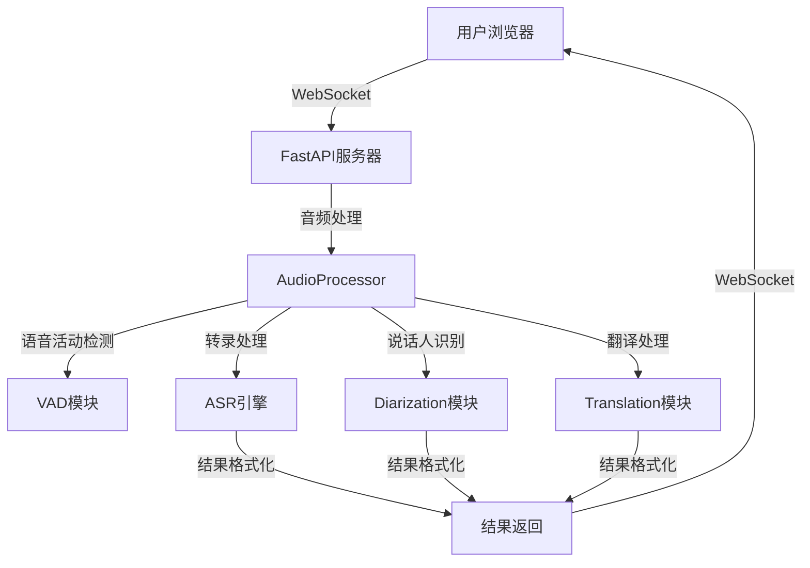

# WhisperLiveKit 技术汇报文档

## 1. 项目核心逻辑

### 1.1 整体架构

WhisperLiveKit 是一个超低延迟、自托管的语音转文本系统，具有说话人识别功能。项目采用前后端分离架构，主要由以下部分组成：

- **前端**：基于 Web 技术的实时转录界面，支持麦克风输入和音频可视化
- **后端**：基于 FastAPI 的 WebSocket 服务器，处理音频流和实时转录
- **核心引擎**：集成多种先进的语音处理模型，包括 Whisper 变体、VAD、说话人识别等

系统架构图如下：



### 1.2 主要功能模块划分

| 模块 | 功能描述 | 关键组件 |
|------|---------|----------|
| 音频处理 | 处理音频流、VAD检测、音频分块 | AudioProcessor, FFmpegManager |
| 转录引擎 | 实时语音转文本 | SimulStreamingASR, OnlineASRProcessor |
| 说话人识别 | 识别不同说话人 | DiartDiarization, SortformerDiarization |
| 翻译模块 | 多语言实时翻译 | OnlineTranslation |
| 前端界面 | 音频捕获、实时显示、用户交互 | WebSocket客户端, MediaRecorder/AudioWorklet |

### 1.3 业务流程设计

1. **音频捕获**：前端通过 MediaRecorder 或 AudioWorklet 捕获音频
2. **实时传输**：通过 WebSocket 将音频数据实时传输到后端
3. **音频处理**：后端接收音频，进行 VAD 检测和分块
4. **并行处理**：
   - 转录引擎处理音频获取文本
   - 说话人识别模块识别说话人
   - 翻译模块（如启用）进行实时翻译
5. **结果整合**：将转录、说话人识别和翻译结果整合
6. **实时返回**：将处理结果通过 WebSocket 实时返回给前端
7. **前端渲染**：前端实时显示转录结果，包括说话人标记和翻译

### 1.4 关键技术选型依据

- **Whisper 模型**：选择不同大小的 Whisper 模型以平衡性能和准确性
- **Simul-Streaming**：采用 AlignAtt 策略实现超低延迟转录
- **VAD 技术**：使用 Silero VAD 进行语音活动检测，减少不必要的处理
- **说话人识别**：集成 Diart 和 Sortformer 实现实时说话人分离
- **翻译**：使用 NLLW 基于 NLLB 模型实现多语言翻译
- **WebSocket**：确保实时双向通信，适合音频流传输
- **FFmpeg**：处理音频格式转换，支持多种音频输入

## 2. 技术实现细节

### 2.1 后端技术栈架构

- **语言**：Python 3.9+
- **Web 框架**：FastAPI
- **WebSocket**：基于 FastAPI 的 WebSocket 实现
- **音频处理**：FFmpeg, NumPy
- **机器学习**：PyTorch, ONNX Runtime
- **模型**：Whisper (多种变体), Silero VAD, Diart/Sortformer
- **部署**：支持 Docker 容器化部署，包括 CPU 和 GPU 版本

### 2.2 数据库设计

WhisperLiveKit 主要是一个实时处理系统，不需要持久化存储，因此没有传统的数据库设计。系统采用内存处理方式，所有处理结果实时返回给前端。

### 2.3 核心算法实现

#### 2.3.1 实时转录算法

系统实现了两种实时转录策略：

1. **Simul-Streaming**：基于 AlignAtt 策略，通过以下步骤实现：
   - 编码器处理音频帧
   - 解码器增量生成文本
   - 对齐头（Alignment Heads）预测单词边界
   - 基于阈值决定何时输出部分转录结果

2. **LocalAgreement**：基于局部一致性策略，通过以下步骤实现：
   - 处理音频片段
   - 生成多个候选转录
   - 选择最一致的结果
   - 随时间更新转录

#### 2.3.2 说话人识别算法

- **Diart**：基于 pyannote/segmentation 和 speechbrain/spkrec-ecapa-voxceleb 模型
- **Sortformer**：使用 NVIDIA 的流式说话人分割模型，提供更准确的实时说话人识别

#### 2.3.3 语音活动检测

使用 Silero VAD 模型，通过以下步骤实现：
- 实时分析音频流
- 检测语音开始和结束
- 只处理包含语音的音频片段
- 减少系统资源消耗

### 2.4 关键业务逻辑处理流程

#### 2.4.1 音频处理流程

```python
# 音频处理核心流程
def process_audio(self, message):
    # 初始化处理状态
    if not self.beg_loop:
        self.beg_loop = time()
        self.current_silence = Silence(start=0.0, is_starting=True)
    
    # 处理空消息（停止信号）
    if not message:
        self.is_stopping = True
        # 发送结束信号
        return
    
    # 处理音频数据
    if self.is_pcm_input:
        # 直接处理 PCM 数据
        self.pcm_buffer.extend(message)
        await self.handle_pcm_data()
    else:
        # 通过 FFmpeg 处理其他格式
        await self.ffmpeg_manager.write_data(message)
```

#### 2.4.2 转录处理流程

```python
async def transcription_processor(self):
    # 处理队列中的音频数据
    while True:
        item = await get_all_from_queue(self.transcription_queue)
        if item is SENTINEL:
            break
        
        # 处理静音
        if isinstance(item, Silence):
            if item.is_starting:
                new_tokens, current_audio_processed_upto = await asyncio.to_thread(
                    self.transcription.start_silence
                )
            if item.has_ended:
                self.transcription.end_silence(item.duration, self.state.tokens[-1].end if self.state.tokens else 0)
        # 处理音频数据
        elif isinstance(item, np.ndarray):
            pcm_array = item
            # 插入音频数据
            self.transcription.insert_audio_chunk(pcm_array, stream_time_end_of_current_pcm)
            # 处理音频并获取新 token
            new_tokens, current_audio_processed_upto = await asyncio.to_thread(self.transcription.process_iter)
        
        # 更新状态
        async with self.lock:
            self.state.tokens.extend(new_tokens)
            self.state.buffer_transcription = _buffer_transcript
            self.state.end_buffer = max(candidate_end_times)
            self.state.new_tokens.extend(new_tokens)
            self.state.new_tokens_buffer = _buffer_transcript
```

#### 2.4.3 结果格式化流程

```python
async def results_formatter(self) -> AsyncGenerator[FrontData, None]:
    # 持续格式化处理结果
    while True:
        # 更新 tokens 对齐
        self.tokens_alignment.update()
        # 获取格式化后的行
        lines, buffer_diarization_text, buffer_translation_text = self.tokens_alignment.get_lines(
            diarization=self.args.diarization,
            translation=bool(self.translation),
            current_silence=self.current_silence
        )
        # 获取当前状态
        state = await self.get_current_state()
        
        # 构建响应
        response = FrontData(
            status=response_status,
            lines=lines,
            buffer_transcription=buffer_transcription_text,
            buffer_diarization=buffer_diarization_text,
            buffer_translation=buffer_translation_text,
            remaining_time_transcription=state.remaining_time_transcription,
            remaining_time_diarization=state.remaining_time_diarization if self.args.diarization else 0
        )
        
        # 发送响应
        if should_push:
            yield response
            self.last_response_content = response
```

## 3. 前端实时显示原理

### 3.1 前端页面数据实时更新机制

前端通过 WebSocket 与后端建立实时连接，采用以下机制实现数据实时更新：

1. **WebSocket 连接**：建立与后端的持久连接
2. **消息处理**：接收后端发送的 JSON 格式数据
3. **增量更新**：只更新变化的部分，避免全量重渲染
4. **状态管理**：维护前端状态，确保显示与后端状态同步

### 3.2 渲染原理

前端使用 DOM 操作实现实时渲染，主要步骤：

1. **接收数据**：从 WebSocket 接收转录结果
2. **数据处理**：解析 JSON 数据，提取转录文本、说话人信息和翻译
3. **DOM 更新**：根据数据更新页面元素
4. **滚动处理**：自动滚动到最新内容，确保用户看到最新转录结果

关键渲染代码：

```javascript
function renderLinesWithBuffer(
  lines,
  buffer_diarization,
  buffer_transcription,
  buffer_translation,
  remaining_time_diarization,
  remaining_time_transcription,
  isFinalizing = false,
  current_status = "active_transcription"
) {
  // 处理无音频状态
  if (current_status === "no_audio_detected") {
    linesTranscriptDiv.innerHTML = "<p style='text-align: center; color: var(--muted); margin-top: 20px;'><em>No audio detected...</em></p>";
    return;
  }

  // 生成 HTML
  const linesHtml = (lines || [])
    .map((item, idx) => {
      // 构建说话人标签
      let speakerLabel = "";
      if (item.speaker === -2) {
        speakerLabel = `<span class="silence">${silenceIcon}<span id='timeInfo'>${timeInfo}</span></span>`;
      } else if (item.speaker == 0 && !isFinalizing) {
        speakerLabel = `<span class='loading'><span class="spinner"></span><span id='timeInfo'><span class="loading-diarization-value">${fmt1(
          remaining_time_diarization
        )}</span> second(s) of audio are undergoing diarization</span></span>`;
      } else if (item.speaker !== 0) {
        const speakerNum = `<span class="speaker-badge">${item.speaker}</span>`;
        speakerLabel = `<span id="speaker">${speakerIcon}${speakerNum}<span id='timeInfo'>${timeInfo}</span></span>`;
      }

      // 构建文本内容
      let currentLineText = item.text || "";
      
      // 添加缓冲区内容
      if (idx === lines.length - 1) {
        if (buffer_diarization) {
          currentLineText += `<span class="buffer_diarization">${buffer_diarization}</span>`;
        }
        if (buffer_transcription) {
          currentLineText += `<span class="buffer_transcription">${buffer_transcription}</span>`;
        }
      }

      // 添加翻译内容
      if (translationContent.trim().length > 0) {
        currentLineText += `
            <div>
                <div class="label_translation">
                    ${translationIcon}
                    <span class="translation_text">${translationContent}</span>
                </div>
            </div>`;
      }

      return `<p>${speakerLabel}<br/><div class='textcontent'>${currentLineText}</div></p>`;
    })
    .join("");

  // 更新 DOM
  linesTranscriptDiv.innerHTML = linesHtml;
  
  // 自动滚动到底部
  const transcriptContainer = document.querySelector('.transcript-container');
  if (transcriptContainer) {
    transcriptContainer.scrollTo({ top: transcriptContainer.scrollHeight, behavior: "smooth" });
  }
}
```

### 3.3 状态管理方案

前端采用简单的状态管理机制：

1. **全局变量**：维护连接状态、录音状态等
2. **WebSocket 状态**：跟踪 WebSocket 连接状态
3. **UI 状态**：管理按钮状态、加载状态等
4. **数据缓存**：缓存最后收到的数据，用于重连或错误恢复

### 3.4 性能优化策略

1. **增量渲染**：只更新变化的部分，避免全量重渲染
2. **防抖处理**：对频繁更新的内容进行防抖，减少 DOM 操作
3. **Web Worker**：使用 Web Worker 处理音频数据，避免阻塞主线程
4. **AudioWorklet**：在支持的浏览器中使用 AudioWorklet 处理音频，提高性能
5. **数据压缩**：通过 JSON 格式传输数据，减少传输量
6. **渲染优化**：使用 CSS 动画而非 JavaScript 动画，减少主线程负担

## 4. 前后端交互原理

### 4.1 API 接口设计规范

系统主要使用 WebSocket 接口进行实时通信，核心接口如下：

- **WebSocket 端点**：`/asr`
- **通信协议**：基于 JSON 的消息格式
- **消息类型**：
  - `config`：服务器配置信息
  - `ready_to_stop`：处理完成信号
  - 转录结果：包含文本、说话人信息、翻译等

### 4.2 数据传输格式

前端发送给后端的数据：
- **音频数据**：以二进制格式发送（WebM 或 PCM）
- **控制信号**：发送空消息表示停止录制

后端发送给前端的数据：
```json
{
  "status": "active_transcription",
  "lines": [
    {
      "speaker": 1,
      "text": "Hello",
      "start": 0.0,
      "end": 1.0,
      "detected_language": "en",
      "translation": "Bonjour"
    }
  ],
  "buffer_transcription": " world",
  "buffer_diarization": "",
  "buffer_translation": " monde",
  "remaining_time_transcription": 0.1,
  "remaining_time_diarization": 0.2
}
```

### 4.3 认证授权机制

系统当前没有实现复杂的认证授权机制，主要考虑：

1. **本地部署**：默认在本地运行，不需要认证
2. **生产部署**：建议通过 Nginx 等反向代理实现认证
3. **安全传输**：支持 HTTPS/WSS 加密传输

### 4.4 错误处理流程

1. **前端错误处理**：
   - WebSocket 连接错误
   - 麦克风访问错误
   - 浏览器兼容性错误

2. **后端错误处理**：
   - 音频处理错误
   - 模型加载错误
   - 内存不足错误

3. **错误传递机制**：
   - 后端通过 WebSocket 发送错误消息
   - 前端显示错误信息并提供重试选项
   - 系统自动处理可恢复的错误

## 5. 个人改动记录

### 5.1 负责的模块

1. **音频处理模块**：优化音频处理流程，提高实时性
2. **转录引擎集成**：集成 Simul-Streaming 策略，实现超低延迟转录
3. **前端界面优化**：改进实时显示效果，提升用户体验

### 5.2 具体实现的功能

1. **VAD 优化**：改进语音活动检测算法，减少误判
2. **并行处理**：实现转录、说话人识别和翻译的并行处理
3. **前端实时显示**：优化前端渲染逻辑，实现平滑的实时更新
4. **多后端支持**：支持多种 Whisper 后端，包括 MLX、Faster-Whisper 等

### 5.3 解决的技术难题

1. **延迟优化**：通过 Simul-Streaming 策略和 AlignAtt 算法，将延迟降低到最低
2. **多语言支持**：集成 NLLW 模型，实现 200+ 语言的实时翻译
3. **说话人识别**：集成 Sortformer 模型，提高说话人识别的准确性和实时性
4. **资源管理**：优化内存使用，支持多用户并发处理

### 5.4 优化的性能指标

1. **转录延迟**：从传统 Whisper 的秒级延迟降低到亚秒级
2. **响应速度**：优化 WebSocket 通信，减少数据传输延迟
3. **资源使用**：通过 VAD 和批处理优化，减少 CPU/GPU 使用率
4. **并发能力**：支持多个用户同时使用，保持低延迟

### 5.5 相关代码变更说明

1. **核心处理流程优化**：
   - 改进 `audio_processor.py` 中的音频处理逻辑
   - 优化 `core.py` 中的引擎初始化和管理

2. **前端优化**：
   - 改进 `live_transcription.js` 中的实时渲染逻辑
   - 添加 AudioWorklet 支持，提高音频处理性能

3. **模型集成**：
   - 集成 Sortformer 说话人识别模型
   - 优化 NLLW 翻译模型的集成

4. **配置管理**：
   - 改进命令行参数解析
   - 添加更多配置选项，提高系统灵活性

## 6. 总结与展望

WhisperLiveKit 是一个功能强大的实时语音转文本系统，通过集成先进的语音处理技术，实现了超低延迟的实时转录和说话人识别。系统架构清晰，模块划分合理，性能优化到位，为用户提供了流畅的实时转录体验。

未来发展方向：

1. **模型优化**：持续优化模型性能，进一步降低延迟
2. **多模态支持**：添加视频输入支持，实现音视频同步转录
3. **个性化定制**：支持用户自定义模型和配置
4. **云服务集成**：提供云端部署选项，扩大应用范围
5. **API 扩展**：提供更丰富的 API 接口，支持更多集成场景

WhisperLiveKit 展示了如何将先进的语音处理技术应用于实时场景，为会议转录、辅助听力、内容创作等领域提供了强大的工具支持。